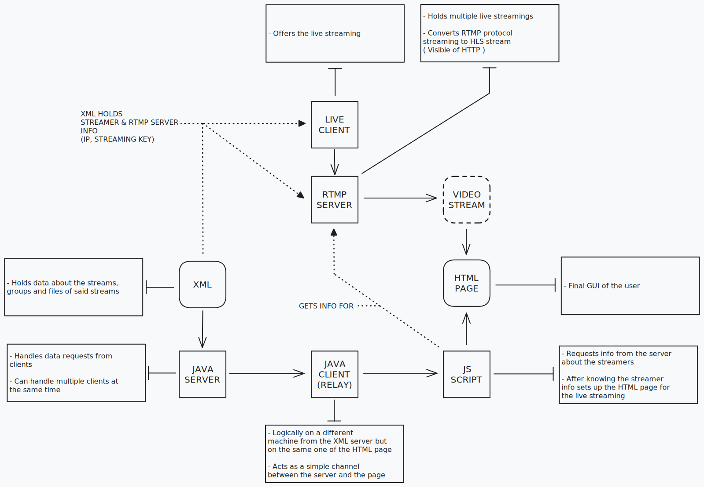

# Progetto server XML -> JAVA -> HTML per streaming live

## Descrizione

Il progetto consiste in un server JAVA che riceve un file XML, poi lo invia ad un client JAVA che lo invia ad una pagina HTML. La pagina HTML riceve i dati e visualizza in tempo reale una live streaming.

## Todo

- [x] Creare il server RTMP
- [ ] Setup del server RTMP
- [x] Creare XML
- [ ] Creare XSD
- [ ] Creare Server Java
  - [x] Connessione
  - [x] Recupero e parsing del file XML
  - [ ] Invio del dati file XML al client ( response )
  - [ ] Ricezione delle request dal client
- [ ] Creare Client Java
  - [ ] Connessione
  - [ ] Trasmissione dei dati tra i due end-point
- [ ] Creare la pagina HTML
  - [x] CSS  
  - [ ] JS
  - [ ] HTML
  - [ ] Connessione
  - [ ] Ricezione dei dati dal server
  - [ ] Visualizzazione dei dati  
